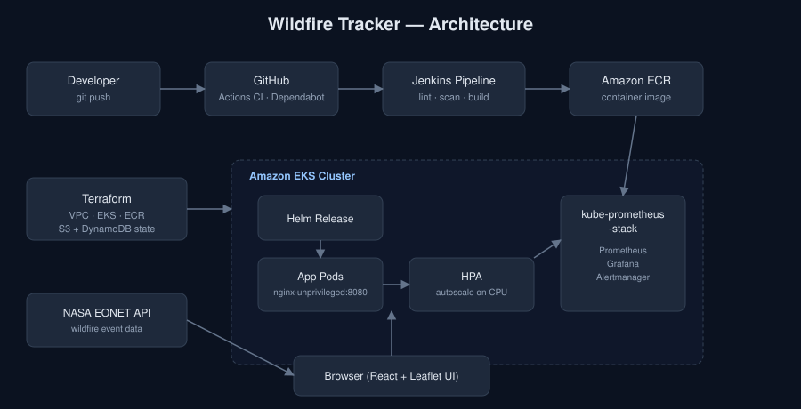

# 🔥 Wildfire Tracker

A real-time wildfire monitoring application built with React and the NASA EONET API, deployed on AWS EKS using a full DevOps pipeline.

---

## Screenshots

> Add screenshots of the running app here, e.g.:
> `docs/screenshot-map.png` — map view with clustered fire markers
> `docs/screenshot-sidebar.png` — sidebar with search/filter and event list
>
> ```markdown
> 
> 
> ```
>
> Run `npm run dev`, open `http://localhost:3000`, and capture a couple of views once there's live event data on the map.

---

## Architecture Overview



---

## Project Structure

```
wildfire-tracker/
├── src/                         # React application source
│   ├── App.tsx                  # Root component (layout)
│   ├── components/
│   │   ├── Header.tsx           # Status filter bar
│   │   ├── Map.tsx              # Leaflet map with fire markers
│   │   └── EventCard.tsx        # Sidebar event list cards
│   ├── types/index.ts           # TypeScript types (EONET API)
│   └── utils/api.ts             # NASA EONET API client
├── Dockerfile                   # Multi-stage build (Node → Nginx)
├── nginx.conf                   # SPA routing + /health endpoint
├── helm/                        # Helm chart
│   ├── Chart.yaml
│   ├── values.yaml
│   └── templates/
│       ├── deployment.yaml
│       ├── service.yaml
│       ├── ingress.yaml
│       └── hpa.yaml
├── terraform/                   # AWS infrastructure
│   ├── provider.tf
│   ├── variables.tf
│   ├── vpc.tf                   # VPC, subnets, NAT gateways
│   ├── eks.tf                   # EKS cluster + managed node group
│   ├── ecr.tf                   # ECR repository
│   ├── outputs.tf
│   └── bootstrap/                # One-time S3 state bucket + DynamoDB lock table
├── docs/
│   └── architecture.svg         # Architecture diagram
├── monitoring/
│   ├── prometheus-values.yaml   # kube-prometheus-stack values
│   └── alerts.yaml              # PrometheusRule alert definitions
└── Jenkinsfile                  # CI/CD pipeline
```

---

## Prerequisites

| Tool | Version |
|------|---------|
| Node.js | 22+ |
| Docker | 24+ |
| Terraform | 1.5+ |
| AWS CLI | 2+ |
| kubectl | 1.29+ |
| Helm | 3.12+ |

---

## Local Development

```bash
# Install dependencies
npm install

# Start dev server (http://localhost:3000)
npm run dev

# Lint
npm run lint

# Build for production
npm run build
```

---

## Docker

```bash
# Build image
docker build -t wildfire-tracker:latest .

# Run locally (container now listens on 8080, non-root)
docker run -p 8080:8080 wildfire-tracker:latest

# Open http://localhost:8080
```

---

## Infrastructure — Terraform

```bash
cd terraform/

# Initialise
terraform init

# Preview changes
terraform plan -var="environment=dev"

# Apply
terraform apply -var="environment=dev"

# Get ECR URL
terraform output ecr_repository_url

# Configure kubectl
$(terraform output -raw configure_kubectl)
```

**Resources created:**
- VPC with public + private subnets across 2 AZs
- Internet Gateway + NAT Gateways
- EKS cluster (Kubernetes 1.29)
- Managed Node Group (`t3.medium`, 2–4 nodes)
- ECR repository with lifecycle policy (keep last 10 images)

### Remote State (S3 + DynamoDB)

State is local by default. To use a shared S3 backend with locking:

```bash
# 1. One-time bootstrap: create the state bucket + lock table
cd terraform/bootstrap
terraform init
terraform apply

# 2. Uncomment the backend "s3" block in terraform/provider.tf,
#    then migrate existing local state into it
cd ../
terraform init -migrate-state
```

The bootstrap config lives in its own state (chicken-and-egg: a backend
can't create the bucket it needs before it exists), so it's applied
separately and only needs to be run once per AWS account.

---

## Deploy — Helm

```bash
# Push image to ECR first
ECR_URL=$(cd terraform && terraform output -raw ecr_repository_url)

aws ecr get-login-password --region us-east-1 \
  | docker login --username AWS --password-stdin $ECR_URL

docker tag wildfire-tracker:latest $ECR_URL:latest
docker push $ECR_URL:latest

# Deploy with Helm
helm upgrade --install wildfire-tracker ./helm \
  --set image.repository=$ECR_URL \
  --set image.tag=latest \
  --wait
```

---

## CI/CD — Jenkins

The [Jenkinsfile](Jenkinsfile) pipeline stages:

| Stage | Description |
|-------|-------------|
| Checkout | Pull from GitHub |
| Install | `npm ci` |
| Lint | ESLint check |
| SonarQube | Static code analysis |
| Trivy FS | Filesystem vulnerability scan |
| Docker Build | Build and tag image |
| Trivy Image | Container image vulnerability scan |
| Push to ECR | Authenticate and push |
| Deploy to EKS | `helm upgrade --install` |

**Jenkins credentials required:**
- `github-credentials` — GitHub token
- `aws-credentials` — AWS IAM credentials
- `ecr-registry` — ECR registry URL

---

## Monitoring

Install kube-prometheus-stack using the provided values:

```bash
helm repo add prometheus-community https://prometheus-community.github.io/helm-charts
helm repo update

helm upgrade --install monitoring prometheus-community/kube-prometheus-stack \
  --namespace monitoring --create-namespace \
  -f monitoring/prometheus-values.yaml

# Apply custom alert rules
kubectl apply -f monitoring/alerts.yaml
```

**Alerts configured:**
- `WildfireTrackerDown` — pod unreachable for >1 min (critical)
- `WildfireTrackerHighCPU` — CPU >80% for >5 min (warning)
- `WildfireTrackerHighMemory` — memory >200MB for >5 min (warning)
- `WildfireTrackerPodRestarting` — repeated restarts (warning)

---

## Data Source

This app uses the free [NASA EONET API v3](https://eonet.gsfc.nasa.gov/docs/v3) — no API key required.

---

## License

MIT
